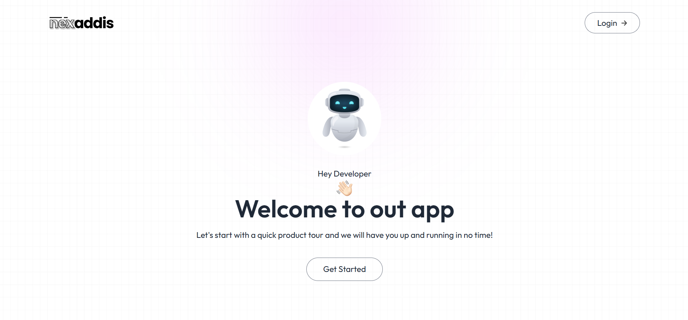
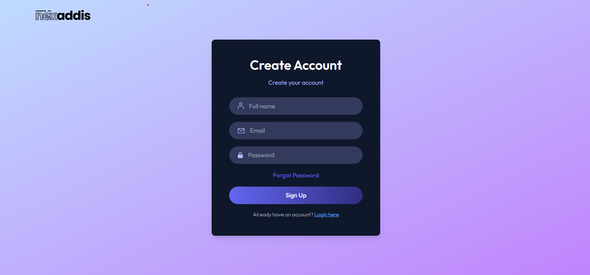
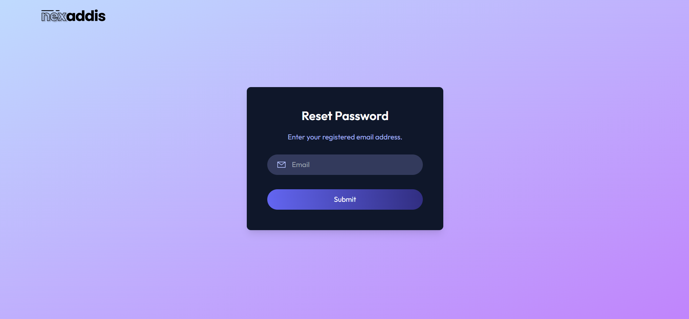
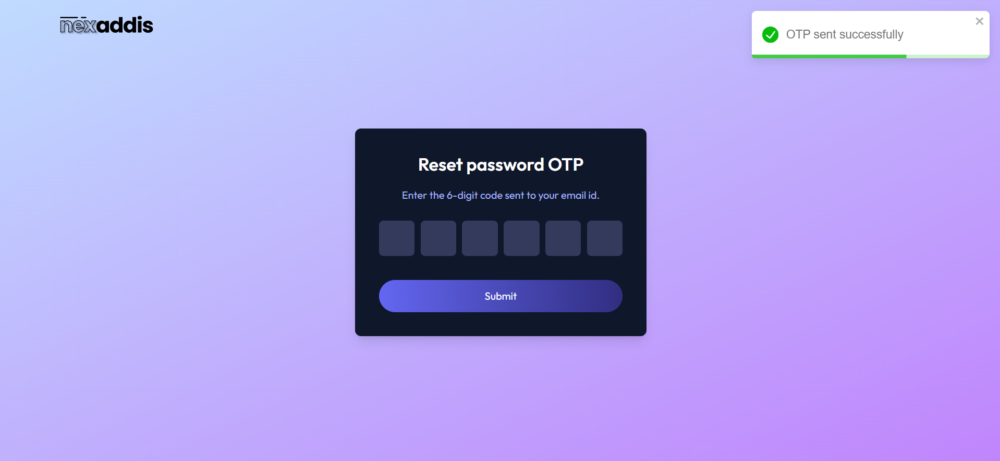
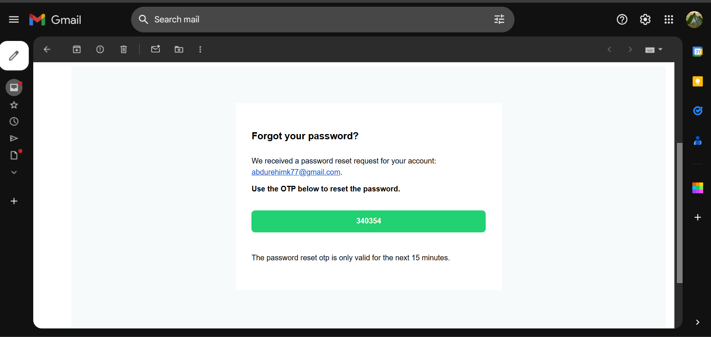
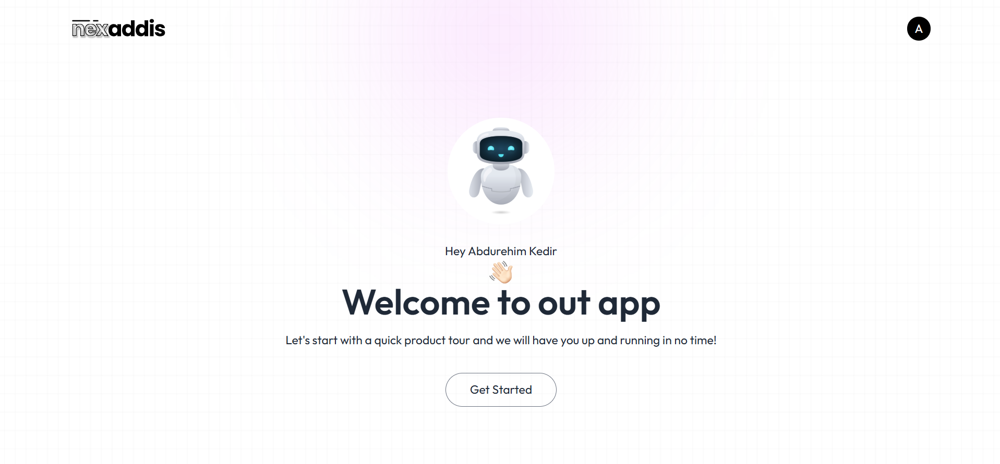

# MERN Authentication Project

This project is a robust authentication system built with the MERN stack (MongoDB, Express.js, React.js, Node.js). It includes user registration, login, and password reset functionality, ensuring secure access with JWT-based authentication and email communication via Nodemailer and Brevo.








## Features

- **User Registration**:
  - Secure user sign-up process with email verification.
  - Passwords are hashed using bcrypt for added security.

- **User Login**:
  - Authenticate users with JWT tokens.
  - Token-based session management with secure cookies.

- **Password Reset**:
  - Forgot password functionality using email verification.
  - Password reset links are sent via Nodemailer integrated with Brevo (Sendinblue).

- **Email Notifications**:
  - Seamless email notifications for account verification and password reset.

- **Secure Backend**:
  - API endpoints protected with JWT middleware.
  - Detailed validation and error handling.

- **Responsive Frontend**:
  - A user-friendly interface built with React.js.
  - Fully responsive design for seamless use on desktop and mobile devices.

## Tech Stack

### Frontend:
- React.js
- TailwindCSS
- Axios for API requests

### Backend:
- Node.js
- Express.js
- MongoDB (Mongoose ORM)
- Nodemailer (Email service)
- Brevo (Sendinblue) for email integration

### Authentication:
- JSON Web Tokens (JWT)
- bcrypt for password hashing

## Installation

1. Clone the repository:
   ```bash
   git clone https://github.com/your-username/mern-authentication.git
